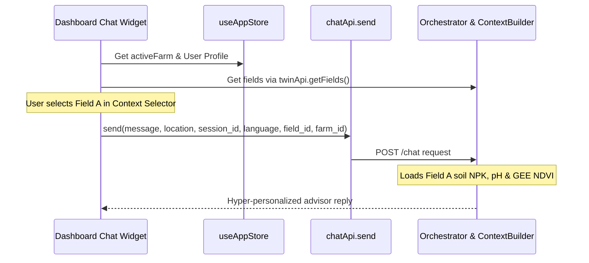
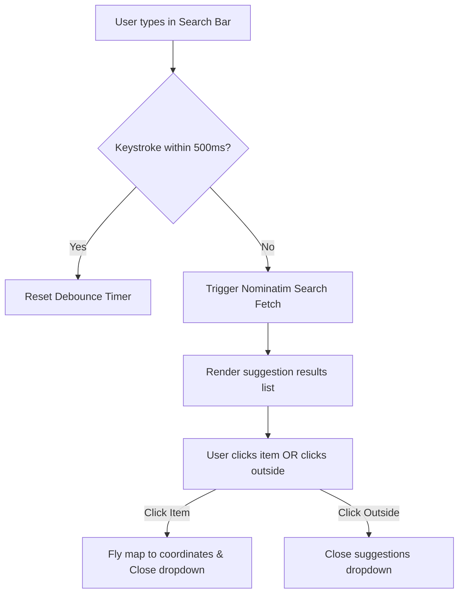
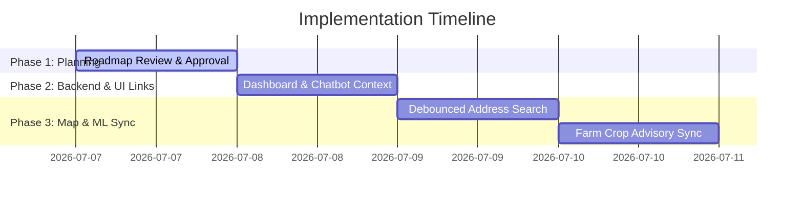

# KrishiMitra Platform Optimization Plan

This document details the step-by-step engineering plan to resolve four critical usability and functional gaps in the **KrishiMitra** dashboard. 

---

## 1. KisanMitra Chatbot Field Context Integration

### Problem
The `orchestrator.py` and `ContextBuilder` in the backend are designed to accept `field_id` and `farm_id` to build a localized "Digital Twin" prompt, but the frontend chat widget on `Dashboard.tsx` only sends the user's message, location, and session ID. This prevents the AI assistant from automatically leveraging soil health metrics (N, P, K, pH), crop history, and satellite advisories.

### Proposed Solution
1. **Fetch Fields on Mount**: Load the logged-in user's fields from `twinApi.getFields()` in `Dashboard.tsx`.
2. **Context Selector Dropdown**: Add a subtle, high-quality dropdown selector in the chat widget header, allowing the farmer to explicitly scope their conversation to a specific field (or fallback to "General Farm/Location").
3. **Payload Enhancement**: Update `chatApi.send` payload invocation to include `selectedFieldId` and the globally active `farmId` from the state store.
4. **Rich Context Injection (Satellite & Mapping)**: When a `field_id` is supplied to the backend:
   * The `ContextBuilder` resolves the field's GPS centroid and polygon boundary.
   * A call is automatically made to the GEE satellite service (`get_ndvi`) to load the latest **NDVI, crop health score, and vegetation index** for that field.
   * The active field's boundaries and area details are included.
   * This rich mapping and satellite telemetry are fed directly into the system prompt, allowing the AI to answer complex queries (e.g., *"How is my wheat health on Field A?"* or *"Based on my latest NDVI, does my crop need fertilizer?"*).




### Affected Files
* `src/pages/Dashboard.tsx`
* `src/services/api.ts`

---

## 2. Dashboard AI Intelligence Card Redirection Fixes

### Problem
The "AI Intelligence Modules" cards on the main dashboard (`Dashboard.tsx`) contain a redirect button. However, the redirection mechanism occasionally fails to propagate clicks correctly. Wrapping the entire card component with React Router navigation ensures a seamless transition and improves user experience.

### Proposed Solution
1. **Interactive Cards**: Make the entire service card clickable by adding a cursor styling (`cursor-pointer`) and binding an `onClick` event.
2. **Programmatic Navigation**: Use React Router's `useNavigate` hook inside `Dashboard.tsx` to handle the redirection programmatically:
   ```typescript
   const navigate = useNavigate();
   ```
3. **Keep Button for Accessibility**: Retain the button inside the card as an aesthetic and accessibility visual anchor, but disable default click interception on it (`pointer-events-none`).

### Affected Files
* `src/pages/Dashboard.tsx`

---

## 3. Optimized Field Mapping Search Bar (Debouncing & Autocomplete)

### Problem
The search suggestions bar in `FieldMapping.tsx` uses OpenStreetMap's Nominatim geocoding engine. However, there is no request debouncing. As a result, every single keystroke triggers an API call, resulting in:
1. Rate-limiting (HTTP 429) from Nominatim.
2. Search query race conditions causing out-of-order suggestions.
3. High network latency and a sluggish typing experience.
4. Suggestions dropdown remains open permanently after selection.

### Proposed Solution
1. **Implement Debouncing**: Introduce a debounced state handler or timer so Nominatim is only queried if the user pauses typing for `500ms`.
2. **Click-Outside Detection**: Add a React `useRef` and window mouse-down event listener to close the suggestions dropdown automatically when the user clicks anywhere else on the screen.
3. **Visually Polish Results Panel**: Upgrade the suggestion list UI using Tailwind-inspired styling (curved border radii, backdrop blurs, clear spacing).



### Affected Files
* `src/pages/FieldMapping.tsx`

---

## 4. Farm Context Selector in Crop Recommendation Page

### Problem
The `CropRecommendation.tsx` page is static. The environmental variables (temperature, humidity, rainfall) are pulled from a single global `activeLocation` value. Farmers with multiple distant fields/farms cannot see dynamic recommendations based on individual farms without manual overrides.

### Proposed Solution
1. **Farm/Field Select Dropdown**: Add a premium select dropdown at the top of the parameter form in `CropRecommendation.tsx`, populated from `farms` in `useAppStore`.
2. **Coordinate & Weather Sync**: When a farm is selected:
   * Pan the active focus coordinates to that farm's center coordinate.
   * Trigger a fresh `weatherApi.get` request for that specific farm's location.
   * Update the live temperature, humidity, and rainfall forms automatically.
3. **Soil Metric Auto-fill**: If fields are registered under the selected farm, pre-fill soil macronutrients (Nitrogen, Phosphorus, Potassium) and pH values from the field profile, minimizing manual data entry for the farmer.

### Affected Files
* `src/pages/CropRecommendation.tsx`

---

## 5. Satellite Analysis Imagery Freshness Indicator

### Problem
When reviewing Earth Engine crop indices and NDVI ratings, it is crucial for farmers to know exactly how recently the imagery was captured to determine whether new fertilization or irrigation actions need to be planned.

### Proposed Solution
1. **Days Old Calculation**: Compute the day gap dynamically between the current date and the satellite capture date (`analysis_date`).
2. **Freshness Status Badges**: Display a responsive, styled badge adjacent to the imagery capture date:
   * **0–3 Days**: A green tag ("Today", "Yesterday", or "X days old") signifying highly accurate, fresh imagery.
   * **4–7 Days**: A blue tag indicating recent imagery.
   * **8+ Days**: An amber tag indicating older imagery.

### Affected Files
* `src/pages/SatelliteAnalysis.tsx`

---

## Implementation Action Plan


